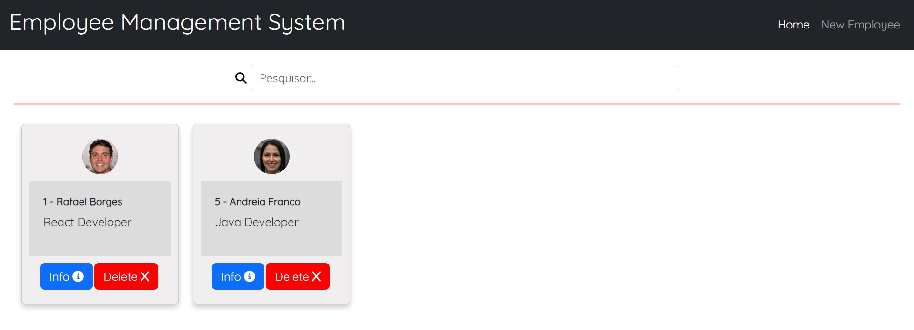
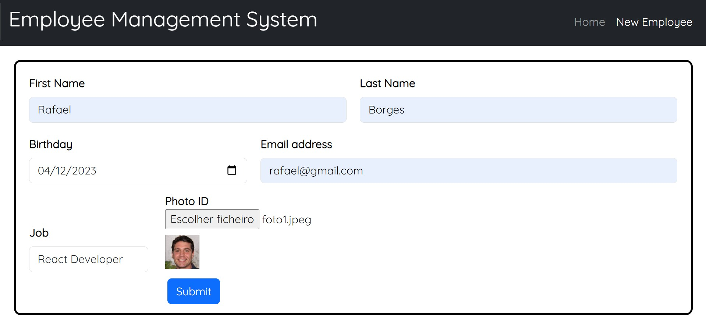
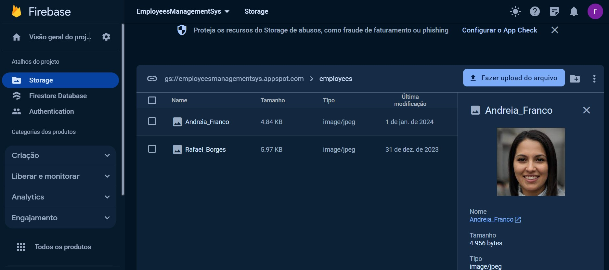

### Description 
Simple full stack project with a **React** frontend and a **Spring** backend for employee management.  
This project involves CRUD operations, utilizes **Google Firebase Storage** for handling images and documents, and enables communication with the backend through **Axios** http requests.  
Real-time updates between server and client are achieved using **Server-Sent Events** (SSE). 

### Technologies
- **ReactJs**
- **Spring Boot**
- **PostgreSQL**
- **Google Firebase - Storage**
- **Server Side events**
- **Axios**

### IDE
IntelliJ 
